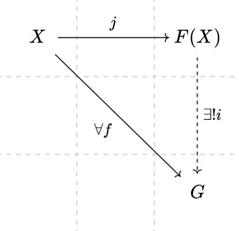

# 自由群 自由代数 自由函子

自由群是由集合 ( 生成集 ) 生成的约束最少的群,
它只满足群的四条定义对它的约束, 从字面意义上来讲,
就是最自由的群, 一切群都可以从自由群里得出. 

## 一个简单例子

通常我们在书写一个群时, 都会用一个字母代表群里的一个元素,
比如:

$$
  a, b, \in G \to a \cdot b \in G
$$

同时, 我们还会指定一些约束这个群的运算规则 $R$ , 比如:

$$
  a \cdot a = e \\
  b \cdot b = a \\
$$

然后我们限定一下初始的生成元只包含 $a, b$ , 那么我们就得到整个群 $G$ 了:

$$
\{ e, a, b \}
$$

我们通过指定生成元, 以及生成元上的约束, 就得到了一个完整的群,
我们不禁要思考, 如果取消掉这些约束, 生成的是什么?

## 自由的生成

我们以一个只有 2 个元素的集合 $X = \{ a, b \}$ 生成的自由群 $F(X)$ 为例:

$$
\because a \in X \therefore a \in F(X) \\

\because b \in X \therefore b \in F(X) \\

\because a \in X \therefore a \cdot a \in F(X) \\

\because b \in X \therefore b \cdot b \in F(X) \\

\because a, b \in X \therefore a \cdot b \in F(X) \\

\space \\

\because a, a \cdot a \in X \\

\therefore a \cdot (a \cdot a) =
(a \cdot a) \cdot a = a \cdot a \cdot a \in F(X) \\

\space \\

\because a \cdot b, b \in X \\

\therefore (a \cdot b) \cdot b =
a \cdot (b \cdot b) = a \cdot b \cdot b \in F(X) \\

\space \\

\cdots
$$

可以看到, 以 $X$ 生成的自由群 $F(X)$ 相当于是以 $a, b$ 为元素组成的列表,
列表里的元素则通过群乘法 $\cdot$ 连接.

这时, 我们就能看懂一般群论教材里自由群的定义, 对于一个生成集 $X$ ,
我们还要拿出一个和他同构的集合 $X^{-1}$ 作为生成集里元素的逆元的集合,
这两个集合的元素, 加上一个单位元 $e$ ,
构成的集合的连接闭包 $C(a,b \mapsto ab, \{ ...X, e, ...X^{-1 } \})$
再模上一个 $\forall a \in X \to a \cdot a^{-1} = e$ 的等价关系,
就得到我们的自由群🌶！

这个群上的运算就是连接运算 $xy$ 后模上一个等价关系, 而且这个群运算是满足群的群运算法则的.

> PS :
> 
> 所以我们在往上数两段里对自由群的描述其实是不准确的,
> 由于群本身存在逆, 之前的描述缺少对单位元和逆元的刻画.
> 但一个自由幺半群确实是由集合元素构成的列表,
> 其中, 空列表是这个自由幺半群的单位元 $e$ .

看不懂上面那两段抽象话没关系, 它只不过是把我们一开始那一大坨
$\because ( \dots ) \therefore ( \dots )$ 的行为用数学描述了一遍,
只不过由于自由群里由于存在逆元, 所以我们需要稍微处理一下
$\cdots a a^{-1} \cdots$ 的情况.

可以看到, 自由群本身是个很简单的概念, 但它实在是太自由了,
以至于随便一个集合生成的群都是无限大的 ( 除了空集 ) .
所以我们通常会对生成的自由群进行一定的约束, 那么问题来了, 约束是什么?

## 那么约束是什么呢?

我们不妨先分析一下由 $X$ 生成的自由群 $F(X)$ 和带上约束生成的普通群 $G(X)$ ,
对于 $j(x), j(y) \in F(x)$ , 我们可以得出 $j(x) \cdot j(y) \in F(X)$ ,
对于 $f(x), f(y) \in G(x)$ , 我们可以得出 $f(x) \cdot f(y) \in G(x)$ .

我们可以看到, 在 $F(X)$ 里的乘法运算的性质, 在普通群 $G$ 里也是满足的!

也就是说, 对于 $\forall x, y \in X$, $F(X)$ 的元素 $j(x), j(y)$
和 $G(X)$ 的元素 $f(x) f(y)$, 有 $j(x) \cdot j(y) = f(x) \cdot f(y)$ :

$$
\forall x, y \in X
\to j(x), j(y) \in F(X)
\to f(x), f(y) \in G(X) \\
\to j(x) \cdot j(y) = f(x) \cdot f(y)
$$

> PS :
> 
> 所以我们在一开始里 $x \in X \to x \in F(x)$ 对自由群的描述其实也是不准确的,
> 简单来说是因为两个 $x$ 所属的对象不在同一个层次 ( 或者说, 同一个范畴内 ) ,
> 所以是不可能即 $\in X$ 又 $\in F(X)$ 的,
> 稍微复杂一点的来说的话, 是因为自由群有不止一种生成方式.

**!** **!** **!**

这是什么? 这是 **群同态** ! ! !

群元的约束就是 **群同态** ! ! !

...

吗 ？

当然不是, 准确来说, 不完全是.
不是任意的约束都对应了任意的群同态,
而是任意一个约束对应于唯一一个群同态.
以一开始的例子为例:

$$
a \cdot a = e \\
b \cdot b = a
$$

实际对应的群同态 $h$ 是:

$$
h(a) \cdot h(a) = h(e) \\
h(b) \cdot h(b) = h(a)
$$

> PS:
>
> 所以之前关于群同态的描述其实也是错误的, 正确的写法应该是:
> 
> $$
> \forall x, y \in X
> \to j(x), j(y) \in F(X)
> \to f(x), f(y) \in G(X) \\
> \to h(j(x)) \cdot h(j(y)) = f(x) \cdot f(y)
> $$

即任意一个约束都对应了一个群同态: 这个群同态把约束里相同的元素映射为同一个元素.

那么, 这个同态和约束真的是一一对应的吗？

## 如果不唯一

我们不妨先考虑一个简单的情况, 假设 $G(X)$ 上有一个自同构 $g$,
如果 $g$ 是非平凡的, 即 $g$ 不是一个恒等映射.
那么我们有 $f \circ g$ 是一个新的不同于 $f$ 的同态.

这太容易了, 我们随意的交换生成集上的两个元素, 
就构造了一个新的非平凡的同构, 例如:

1. 令 $x, y \in X$ , 并令 $f(x) = a, f(y) = b \in G(x)$ ,

2. 那我们可以构造一个同构 $g$ 使得 $g(a) = b, g(b) = a$ ,

3. 可以验证这是一个同构.

> 正因为从生成集到生成元的映射不是唯一的,
> 所以我们前面才说自由群有不止一种生成方式.

这太简单了! 所以我们打算上点难度,
我们希望不以上面的方式找到一个同构,

> 即, 我们希望我们在保证自由生成的方式是唯一的情况下找到一个同构.

即, 满足下面这个性质:

$$
\forall x \in f(X) \to g(x) = x
$$

这个同构是保生成元的, 换句话说, 这个映射在生成元上是一个恒等映射.

> $f(X)$ 的意思是 $f(X) \coloneqq \{ f(x) | x \in X \}$ , 即 $f$ 作用在 $X$ 上的像.

好, 那么我们考虑这个同构下的乘法, 这个同构在生成元上的运算应该满足:

$$
\forall x, y \in f(X) \to g(x) \cdot g(y) = x \cdot y = g(x \cdot y)
$$

也就是说, 这个同构在乘法的作用下也是一个恒等映射.

那么对于任意一个属于 $G(X)$ 的 $a$ , 它都可以写成生成元的乘积的形式,
假设是 $a = x \cdot y \cdot z$, 那么:

$$
g(a) = g(x \cdot y \cdot z) = x \cdot y \cdot z = a
\\
\forall a \in G(X) \to g(a) = a
$$

也就是说, 如果限定了同构在生成元上是个恒等映射, 那么它在整个群上也是恒等映射了.

## 另一条道路

既然此路不通, 我们不妨分析一下是否存在其它的同态 $h'$ ,
不同于我们原本指定的那个同态 $h$ .

什么是不同的同态呢? 我们先假设存在有不同的同态:

因为我们的同态是保生成集的,

这意味着我们如果对于同态 $h$ 有 $h(a) \cdot h(b) = h(a \cdot b)$ ,

那么同样的, 对于同态 $h'$ 有 $h'(c) \cdot h'(d) = h(c \cdot b)$ .

因为我们的群元素是由生成集生成的, 也就是说,
任意 $h'$ 的像集 $G'(X)$ 里的元素 $x$ ,
都可以写成生成元的乘积的形式, 比如是 $a \cdot b \cdot c \cdot a^{-1}$

那么 $h'(x)$ 可以写成:

$$
h'(x) = h'(a \cdot b \cdot c \cdot a^{-1})
  = h'(a) \cdot h'(b) \cdot h'(c) \cdot h'(a^{-1})
$$

由于两个同态都是保生成集的, 所以他们在输出集上都是恒等映射:

$$
h | _ X = id = h' | _ X \\
\forall x \in X \to h(x) = h'(x)
$$

那么对于任意可以由生成元表示的元素, $h$ 和 $h'$ 的值也应该是相等,
我们相当于把上一节的废话在这一节里用一种新的方式重新说了一遍.

现在我们差不多可以下结论了, 在保生成集的情况下, 从 $F(X)$ 到 $G(X)$ 的同态是唯一的.

## 一种群的表示方式

## 后记

// 群的展示
...
看完以上这些内容, 相信你现在能更深刻理解下面这张交换图了.

- 学有余力的同学可以尝试看一看[这篇文章](https://zhuanlan.zhihu.com/p/386370338).

- 群展示的[Wiki](https://zh.wikipedia.org/wiki/%E7%BE%A4%E7%9A%84%E5%B1%95%E7%A4%BA)

