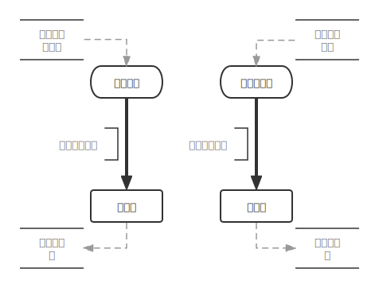

# 基于事件触发链条的低代码编程模型

虽然题目是叫基于XXX的ZZZ，但实际上这个想法并不完善，
这篇文章主要是记录这个 Idea 的一些未曾解决的问题，
而不是提出一个完善的解决方案。

为什么要提出一个新的低代码模型呢？市面上不是已经有很多流程引擎相关的产品了吗？
这是因为目前市面上主要存在的两种编程模型:

- 基于权限审批的流程编辑模型
- 基于流程图的代码生成器
  
存在几个问题：

- 基于人员的权限审批流程很多时候是冗余的，用于妥协的解决方案，
  它本身并没有解决什么问题，它只是把数字化转型中该解决的问题托到转型后绥靖而已。
  这种范式本身就是不适合用于解决问题的。
- 基于流程图的代码生成器则主要存在两个问题：
  - 流程图是一种和代码同构的用于展现程序的东西，
    而且编辑同样功能的流程图，比编辑同样功能的代码所要花费的工作量要多得多得多，
    而且流程图并没有提供一种新的让人更容易理解程序的方式，
    它只是把同样的用代码描述的废话用抽象的图案重新描述一遍罢了，
    既然新的方式并没有带来任何提升，那我们为什么要使用新方案呢？
  - GUI 的展示逻辑和基于文本的代码的展示逻辑本身就是不同的，
    代码是指令的线性排列 （暂且忽略那些所谓的 FP, OOP 等编程范式，
    这里所指的并不只是过程式编程），
    而 GUI 可以方便的展示多个节点之间的互动关系，
    把一个 Graph 用图画出来明显要比用代码描述简单直观得多，
    这是独属于 GUI 交互方式的优势，但现有低代码平台却没有利用好。

因此，有必要提供一种新的适用于 GUI 的编程模型来重新解决这个问题。

## 动机

我们考虑一个最简单的智能家居场景，用智能开关控制一个灯泡亮灭，
我们只需要智能开关发出一个 `切换状态` 的事件给灯泡，
然后灯泡执行这个事件就行了。
这个开关可以不仅仅是具体的按钮开关，
当这个开关变成人体传感器时，就是智能家居最经典的应用，
智能开关灯。

这个模型十分简单，每一个传感器和每一个执行器都是一一配对的，
整个模型用一个 `键值对列表` 就可以描述。
对应的键 ( 传感器 ) 触发对应的值 ( 执行器 ) 。
我们暂且称之为 `一号模型`。

但有些时候传感器不是一一对应的，比如我们希望卧室的灯可以通过墙上的按钮进行开关，
而且为了方便，我们希望卧室的入户和床头各有一个开关，而且我们希望他可以和闹钟联动，
每天早上 7 点时能自动开灯并打开窗帘。

这个时候，我们的一号模型就无法对这种需求进行建模了，
因为我们的模型里，传感器和执行器是一一对应，没法处理这种多对一或者一对多的模型。

我们可以稍微修改一下我们的一号模型，使其节点在某一时刻可以同时向多个节点发送

<!--  -->

大多数智能家居的场景都可以拆分成这种某个传感器采集信息，发送事件，
某个执行设备接受事件，执行动作。

## 模型

我们根据以上例子，很容易就能提出这样一个模型：

一个程序由某个开始事件触发，这个由其他程序触发的开始事件会负载一个参数，
这个参数会通过连线传递给下一个（或一些）节点，

这实际上是由各种各样的节点 ( node ) 相互链接形成的图 ( graph )，
这个图只是我们的计算模型的语法，
即一个计算或者说一个程序由一系列节点通过边相互链接组成。

在语法之上，还有语义，语法只是告诉我们，什么东西算一个合法的程序。
比如早期打孔计算机的语法就是在什么样的纸板上打多大的孔？
孔之间的距离，孔的大小，位置等等，就构成了打孔纸带程序的语法。

## 问题

但当考虑多个事件触发一个事件时，问题就出现了。

对于一个已经编辑好的程序

问题在于对于同一个程序，事件触发的程序是不是单例的？

